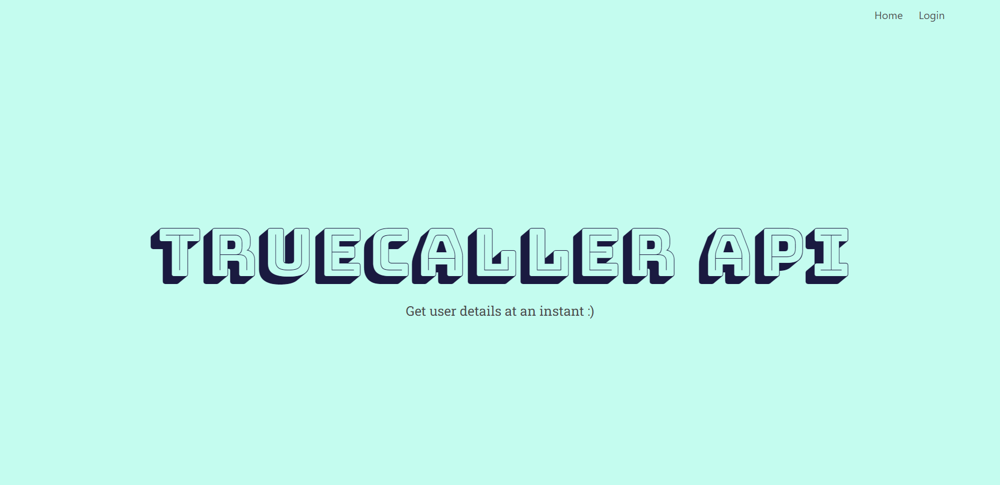
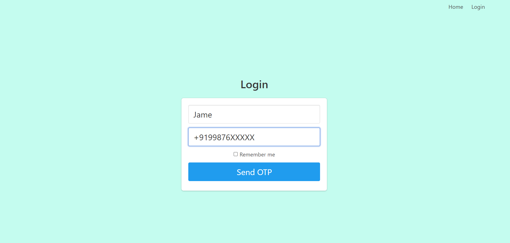
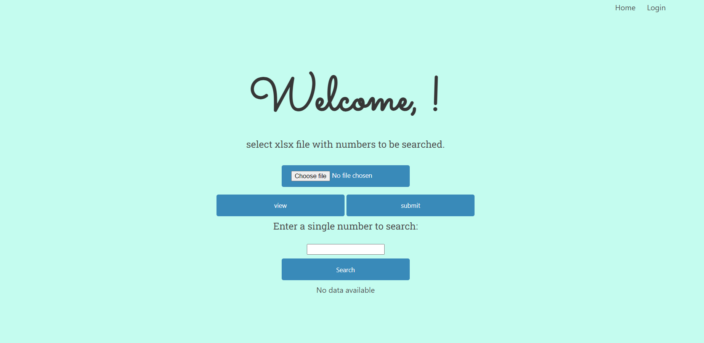
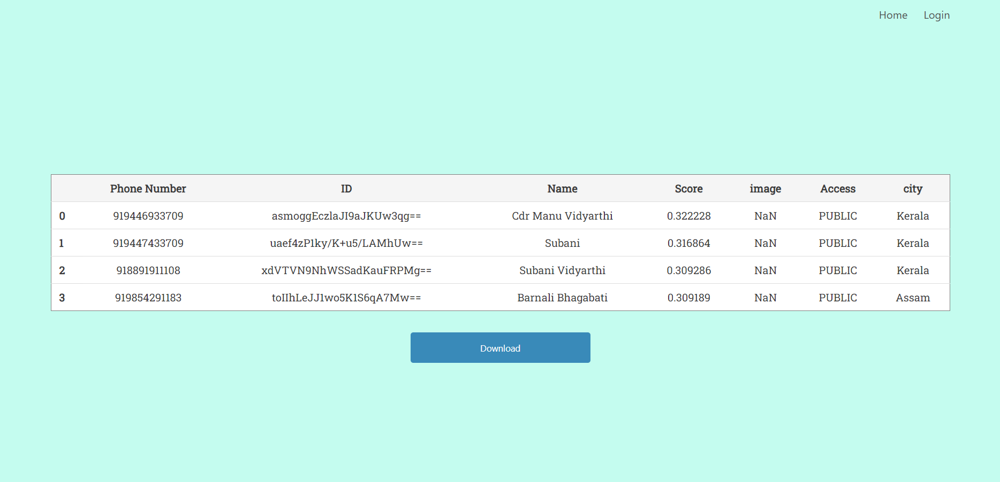
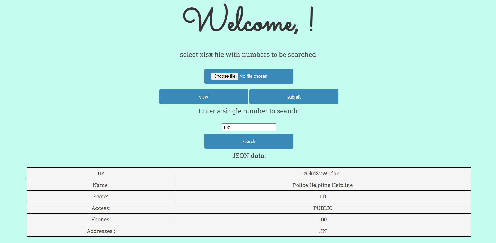

# Truecaller Data Fetcher

## Tech Specifications
- HTML
- CSS
- Python
- Flask
- Bootstrap

## Project Description
The Truecaller Data Fetcher is a Flask web application that utilizes the Truecallerpy API. It allows users to log in using their phone number, receive an OTP, and perform bulk/single number searches. The application provides detailed information about the owner of the phone number, displayed in a table format.

## Screenshots

### Home

Home page of the Truecaller Data Fetcher web application.

### Login

Login page where users can enter their phone number and receive an OTP.

### Dashboard

Dashboard page displaying the user's personalized information and options for number search.

### Bulk Number Search

Bulk number search page allowing users to upload a file containing multiple phone numbers for search.

### Single Number Search

Single number search page where users can enter a phone number for detailed information retrieval.

## How to Run
1. Clone the repository: `git clone <repository-url>`
2. Navigate to the `env` folder: `cd env`
3. Run the main Python file: `python main.py`
4. Access the application in your web browser at: `http://localhost:5000/`
